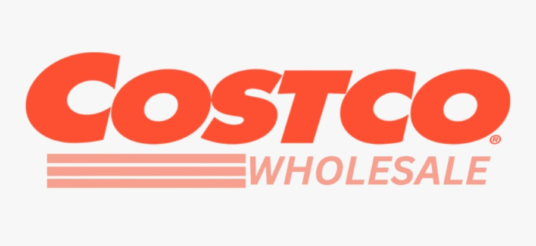

# Costco-Sales-Dashboard

## **Access the Dashboard**  
Explore the live dashboard here: **[Link to Online Reports Page](https://app.powerbi.com/view?r=eyJrIjoiMmUwZTMyZmMtZDdmMy00NGFlLTk2MWUtNzFhOGE1NWIxY2U0IiwidCI6ImRmYzZlYTk5LTg4NDAtNDJhMS1hYzk4LWIxOTYyMTlmNWNhYyJ9&embedImagePlaceholder=true)

## **Dashboard Screenshots**

## interactive filters

### **Technology Stack**  
- **Data Sources:** CSV.
- **Tools:** Power BI, Power Query, DAX.

## **Key Learnings**   
- **Advanced Data Transformation:** Enhanced proficiency in Power Query for cleaning, merging, and transforming data.  
- **DAX Proficiency:** Improved skills in creating complex measures for dynamic KPIs and insights.  
- **Interactive Design:** Gained experience in building user-friendly, visually appealing dashboards with interactivity.  
